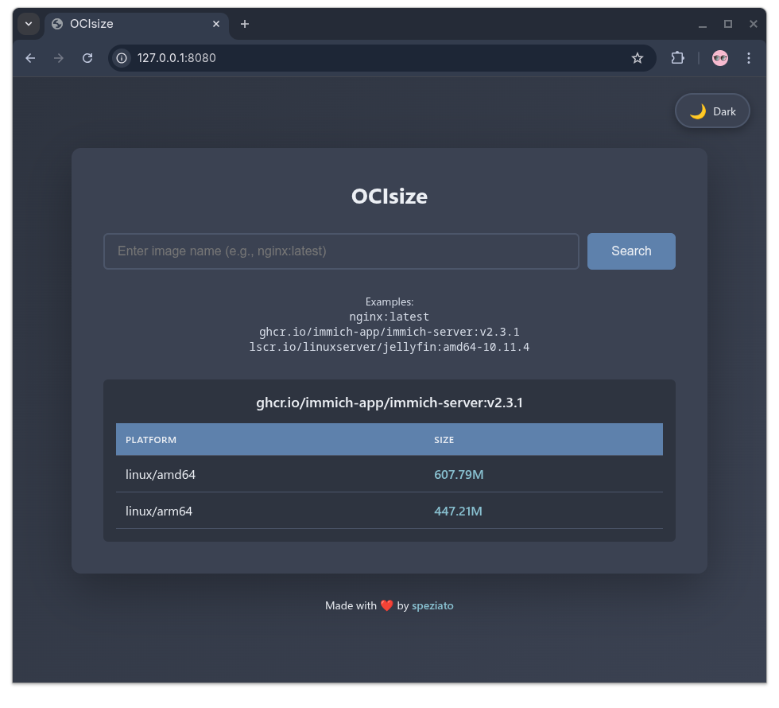

# OCIsize

This is a very small utility to query OCI registries for container image sizes across platforms.

I built this for myself because I have a *really* bad internet connection and I always wonder "will I download that image in a reasonable time or do I need to schedule it for tonight?". Now I know, and you can too!

Built with Python and zero external dependencies. It works with any registry that adheres to the [OCI Distribution Specification](https://github.com/opencontainers/distribution-spec) and the original [Docker Registry HTTP API V2](https://github.com/opencontainers/distribution-spec/blob/ef28f81727c3b5e98ab941ae050098ea664c0960/detail.md#on-failure-authentication-required-3) on which the OCI Specification is based, and is still valid for most registries.

## CLI Variant

You can run `ocisize` in a terminal:
  
```bash
$ git clone https://github.com/speziato/ocisize
$ podman build ./ocisize --target cli --tag ocisize
$ podman run -t --rm ocisize --help

usage: cli.py [-h] [-f {table,json,csv}] [-q] [--no-spinner] image

Query OCI registries for container image sizes across platforms

positional arguments:
  image                 Container image name (e.g., nginx:latest,
                        my-public-repo.io/project/image:tag)

options:
  -h, --help            show this help message and exit
  -f, --format {table,json,csv}
                        Output format (default: table)
  -q, --quiet           Suppress error messages and spinner
  --no-spinner          Disable spinner animation

Examples:
  ocisize nginx:latest
  ocisize ghcr.io/immich-app/immich-server:v2.3.1
  ocisize --format json lscr.io/linuxserver/jellyfin:amd64-10.11.4

$ podman run -t --rm ghcr.io/speziato/ocisize:latest nginx:latest
⠹ Fetching manifest for quay.io/skopeo/stable:latest
Image: quay.io/skopeo/stable:latest                  

PLATFORM       SIZE  
---------------------

linux/amd64    78.86M
linux/arm64    75.36M
linux/ppc64le  85.17M
linux/s390x    79.62M
```

It can also be aliased:

```bash
alias ocisize='podman run -t --rm ocisize'
ocisize <image>
```

## Web UI Variant

You can also run OCIsize as a web UI. Themed with [Nord Palette](https://www.nordtheme.com/docs/colors-and-palettes), it has light/dark themes and just basic HTML + CSS + JS:

```bash
git clone https://github.com/speziato/ocisize
podman build ./ocisize --target web --tag ocisize-web
podman run -p 8080:8080 ocisize-web
```

Open [`http://127.0.0.1:8080`](http://127.0.0.1:8080) in a browser and enter the name of the image:



## License

OCIsize is open source and licensed under the [MIT License](./LICENSE).
